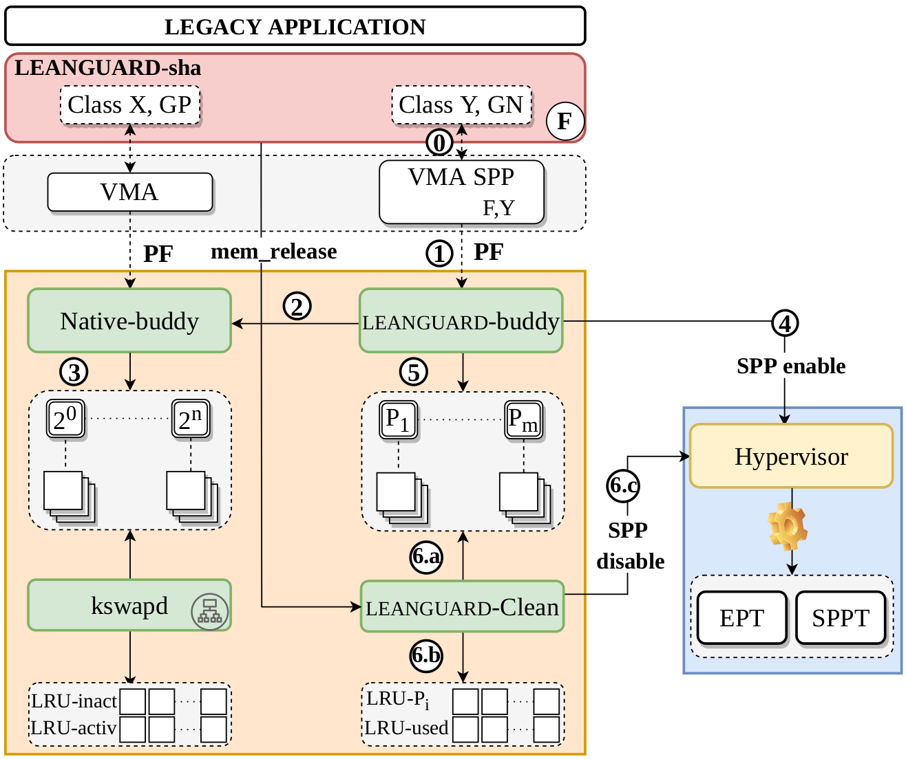

# GuaNary

Buffer overflow is a widespread and prevalent memory safety violation in C/C++, reported as the top vulnerability in 2022. Secure memory allocators are generally used to protect systems against attacks that may exploit buffer overflows. Existing allocators mainly rely on two types of countermeasures to prevent or detect overflows: canaries and guard pages, each with its own pros and cons in terms of detection latency and memory footprint.
For virtualized cloud applications, this paper introduces GuaNary, a novel defense against overflows allowing synchronous detection at a low memory footprint cost. To this end, GuaNary leverages Intel Sub-Page write Permission (SPP), a recent hardware virtualization feature that allows to write-protect guest memory at the granularity of 128B (namely, sub-page) instead of 4KB. We implement a software stack, LeanGuard, which promotes the utilization of SPP from inside virtual machines by new secure allocators that use GuaNary. Our evaluation shows that for the same number of protected buffers, LeanGuard consumes 8.3× less memory compared to SlimGuard, a state-of-art secure allocator. Further, for a given amount of memory, LeanGuard allows protecting 25× more buffers than SlimGuard.
The following figure presents the design of LeanGuard.

<!--  -->

